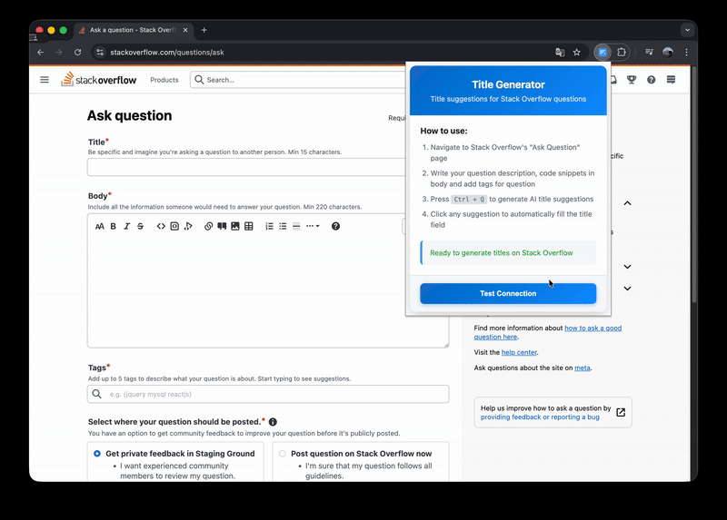

# Title Generation for StackOverflow

A Chrome extension that automatically generates optimized titles for StackOverflow questions.

## Demo Plugin



## Features

- **Automatic Title Generation**: Generate relevant titles based on question description, code snippets, and tags
- **Chrome Extension Integration**: Seamlessly works on StackOverflow's question creation page
- **AI-Powered**: Uses advanced deep learning models for title optimization
- **Real-time Processing**: Fast title generation with processing time feedback
- **Docker Support**: Easy deployment with Docker containers

## Project Structure

```
Title_Generation_StackOverflow/
├── backend/               # FastAPI backend service
│   ├── app.py             # Main FastAPI application
│   ├── requirements.txt   # Python dependencies
│   ├── Dockerfile         # Docker configuration
│   ├── docker-compose.yml # Docker Compose setup
│   └── .dockerignore      # Docker ignore file
├── plugin/                # Chrome extension
│   ├── manifest.json      # Extension manifest
│   ├── popup.html         # Extension popup interface
│   ├── popup.js           # Popup functionality
│   ├── main.js            # Content script for StackOverflow
│   ├── background.js      # Service worker
│   ├── styles.css         # Extension styling
│   └── images/            # Extension icons
└── README.md              # This file
```

## Installation & Setup

### Prerequisites

- Python 3.11+ (for backend)
- Google Chrome browser
- Docker (optional, for containerized deployment)

### Method 1: Docker Deployment (Recommended)

1. **Clone the repository**
   ```bash
   git clone https://github.com/BienKieu1411/Title_Generation_StackOverflow
   cd Title_Generation_StackOverflow
   ```

2. **Start the backend with Docker**
   ```bash
   cd backend
   docker-compose up --build
   ```

3. **Load the Chrome extension**
   - Open Chrome and go to `chrome://extensions/`
   - Enable "Developer mode"
   - Click "Load unpacked"
   - Select the `plugin/` folder

### Method 2: Manual Setup

#### Backend Setup

1. **Navigate to backend directory**
   ```bash
   cd backend
   ```

2. **Create virtual environment**
   ```bash
   python3 -m venv .venv
   source .venv/bin/activate  # On Windows: .venv\Scripts\activate
   ```

3. **Install dependencies**
   ```bash
   pip install --upgrade pip
   pip install -r requirements.txt
   ```

4. **Run the backend**
   ```bash
   python app.py
   ```
   
   Or with uvicorn directly:
   ```bash
   uvicorn app:app --host 0.0.0.0 --port 8000 --reload
   ```

#### Chrome Extension Setup

1. **Open Chrome Extensions**
   - Go to `chrome://extensions/`
   - Enable "Developer mode" (toggle in top-right)

2. **Load the extension**
   - Click "Load unpacked"
   - Select the `plugin/` folder from the project directory

## Usage

### Using the Chrome Extension

1. **Navigate to StackOverflow**
   - Go to [StackOverflow Ask Question](https://stackoverflow.com/questions/ask)
   - The extension will automatically activate

2. **Fill in your question details**
   - Add your question description
   - Include relevant code snippets
   - Select appropriate tags

3. **Generate title**
   - Click the extension icon in your browser toolbar
   - Use Button "Test Connection" to check connection with backend
   - Use Ctrl + Q to analyze your question and generate optimized titles
   - Choose from the suggested titles

### API Usage

The backend provides REST API endpoints:

#### POST /genTitle
```bash
curl -X POST "http://localhost:8000/genTitle" \
  -H "Content-Type: application/json" \
  -d '{
    "description": "How to sort an array in Python?",
    "code": "arr = [3, 1, 4, 1, 5]",
    "tag": "python"
  }'
```

#### GET /genTitle
```bash
curl "http://localhost:8000/genTitle?description=How%20to%20sort%20an%20array%20in%20Python?&code=arr%20=%20[3,%201,%204,%201,%205]&tag=python"
```

#### Response Format
```json
{
  "title_list": [
    "How to sort an array in Python?",
    "Python array sorting methods",
    "Sorting arrays in Python - best practices"
  ],
  "processing_time": 2.34
}
```

## Docker Commands

### Basic Docker Commands
```bash
# Build and run
docker-compose up --build

# Run in background
docker-compose up -d --build

# View logs
docker-compose logs -f

# Stop services
docker-compose down

# Rebuild from scratch
docker-compose down
docker-compose build --no-cache
docker-compose up
```

### Custom Port Configuration
If port 8000 is already in use, modify `docker-compose.yml`:
```yaml
ports:
  - "8001:8000"  
```

## Troubleshooting

### Backend Issues

**Port already in use**
```bash
lsof -i :8000
kill -9 <PID>
```

**Dependencies not installing**
```bash
pip install --upgrade pip
pip cache purge
```

### Extension Issues

**Extension not loading**
- Ensure Developer mode is enabled
- Check browser console for errors
- Verify the `plugin/` folder is selected correctly

**Extension not working on StackOverflow**
- Refresh the StackOverflow page
- Check if the extension is enabled
- Verify backend is running on localhost:8000

### Docker Issues

**Container won't start**
```bash
# Check logs
docker-compose logs backend

# Rebuild without cache
docker-compose build --no-cache
```

**Permission issues**
```bash
# Fix file permissions
sudo chown -R $USER:$USER .
```
